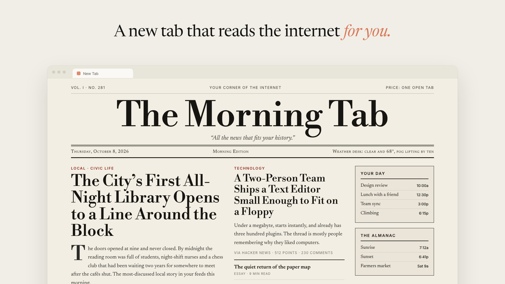

# AI Homepage

**A new tab that reads the internet for you.**

AI Homepage replaces your browser's new-tab page with one that's written for you. An
agent looks at what you've actually been browsing, opens the pages you follow
(signed in as you), and writes a fresh homepage from what it finds there. It
rebuilds itself in the background, so each new tab is up to date.


<sub>Illustration. Your homepage is built from your own browsing, so its stories will be different.</sub>

A morning newspaper is just one look. You can describe any look and the next build
follows it: a quiet one-column digest, a dense dashboard, a green-on-black
terminal, a zine.

> **Privacy, up front.** To build your homepage, the extension sends a summary of
> your browsing history (top domains, visit counts, a few page titles) and the
> cleaned-up HTML of up to 8 pages to the Anthropic API, using your own API key.
> Those pages are loaded in your signed-in browser, so they can include private
> content. The agent session and every uploaded page are deleted when each build
> ends. Your API key stays in the extension's local storage. More detail in
> [ARCHITECTURE.md](./ARCHITECTURE.md#privacy).

---

## Install

You need Chrome (or another Chromium browser) or Firefox, [Node.js](https://nodejs.org) 20+,
and an [Anthropic API key](https://console.anthropic.com).

```bash
git clone https://github.com/ThariqS/ai-newtab.git
cd ai-newtab
npx pnpm@10.11.1 install
npx pnpm@10.11.1 build
```

(If you already have [pnpm](https://pnpm.io), plain `pnpm install && pnpm build` works too.)

Then load it into Chrome:

1. Go to `chrome://extensions`.
2. Turn on **Developer mode** (top right).
3. Click **Load unpacked** and choose `apps/extension/.output/chrome-mv3`.

If Chrome asks whether to keep the changed new-tab page, choose **Keep it**.

### Firefox

Build the Firefox version instead:

```bash
npx pnpm@10.11.1 build:firefox
```

Then load it:

1. Go to `about:debugging#/runtime/this-firefox`.
2. Click **Load Temporary Add-on…** and choose
   `apps/extension/.output/firefox-mv2/manifest.json`.

If Firefox says an extension changed your new tab page, keep the change.

Firefox removes temporary add-ons when it quits, so you'll need to load it again
after a restart. Regular Firefox only keeps signed add-ons installed.
[Developer Edition](https://www.mozilla.org/firefox/developer/) and Nightly can
keep this unsigned one: set `xpinstall.signatures.required` to `false` in
`about:config`, run `npx pnpm@10.11.1 --filter @homepage/extension zip:firefox`, then in
`about:addons` click ⚙️ → **Install Add-on From File…** and choose the
`-firefox.zip` file in `apps/extension/.output/`.

## Your first homepage

1. Open a new tab and paste your Anthropic API key.
2. Click **Build today's homepage**.
3. Watch it work. The progress view walks through each step: preparing the
   agent, reading your history, opening pages in your browser, analyzing them,
   and writing your homepage.

The first build takes a few minutes. You can close the tab while it runs, since
the build lives in the extension's background worker and appears in any new tab
you open.

## Make it yours

Click **⚙️ Settings** on the new tab.

**Instructions.** Anything you write here goes into every build and takes priority
over the agent's own defaults. This box sets both the content and the look:

| You write | You get |
| --- | --- |
| *"A morning newspaper. Serif type, a big masthead, a lead story, a column of briefs."* | A broadsheet front page |
| *"One calm column. No images. Five things worth reading, with one line on why."* | A quiet reading list |
| *"Dense dashboard: GitHub PRs and issues first, then Hacker News, then everything else."* | A work cockpit |
| *"Green-on-black terminal, monospace, like a 1980s BBS."* | Exactly that |
| *"Skip sports and politics. Always show the weather and my next three calendar events."* | Your rules, every day |

Click **Save & rebuild** to apply them right away.

**Model.** Choose which Claude model writes your page:

- **Claude Sonnet 5.5** (default): the best balance of quality and cost.
- **Claude Haiku 5.5**: the fastest and cheapest.
- **Claude Opus 5.5**: the most careful editor, and the most expensive.

The new model takes effect from your next build.

**Rebuild automatically.** On by default. Once your homepage is older than the
interval you pick (6, 12, 24 or 48 hours), the extension rebuilds it quietly in the
background. It only starts after you've built once by hand, and it won't retry a
failed build until the next interval, so it never loops.

**↻ Rebuild** in the top-right corner rebuilds right away.

## Good to know

- **Cost.** Each build is a single agent session billed to your API key. What it
  costs depends on the model and on how much it reads. Haiku is the cheapest
  choice, and you can turn off automatic rebuilds to build only when you ask.
- **What it can see.** It ranks the sites in your history and opens up to 8 of
  them per build. It skips search engines, webmail, banking and logged-out
  marketing pages. Anything it can't open is reported, not hidden.
- **Links are real.** Every link on the page comes from a page the agent actually
  read. It's told never to invent a URL.
- **Interrupted builds.** If the browser closes mid-build, the new tab offers
  **Resume interrupted build** next time.
- **Updating.** After pulling new code, run `npx pnpm@10.11.1 build` again, then
  click the reload icon on the extension in `chrome://extensions`. In Firefox, run
  `build:firefox` and click **Reload** on the add-on in `about:debugging`.

## How it works

1. **`getHistory`**: the agent gets a ranked summary of your most-visited domains.
2. **`getPageHtml`**: it picks up to 8 pages, which the extension opens in a
   background window, cleans up, and mounts into the agent's sandbox as files.
3. **`grep` / `read`**: the agent pulls headlines, posts and links out of those
   files inside its sandbox.
4. **`write`**: it writes one React component, which the new tab renders.

The extension's background worker drives a
[Claude Managed Agents](https://docs.claude.com) session directly, with no server
in between. The two custom tools run in the extension because they need
`chrome.history` and `chrome.tabs`. Everything else happens in the agent's
sandbox, where shell access is off: scraped pages are untrusted input.

See **[ARCHITECTURE.md](./ARCHITECTURE.md)** for the event flow, the layout, and
the gotchas worth knowing.

## Development

```
packages/agent-core   the agent loop: host-agnostic, no chrome.* or node:*
apps/extension        the extension (WXT + React): MV3 for Chrome, MV2 for Firefox
harness               Bun scripts that run agent-core outside the browser, and test the built extension
```

```bash
pnpm dev                     # WXT with hot reload
pnpm dev:firefox             # the same, in Firefox
pnpm typecheck               # all packages
pnpm test                    # unit tests (no API calls; needs Bun)
pnpm extension:test          # loads the built extension into headless Chrome (no API calls)
pnpm extension:test:firefox  # the same in headless Firefox, after pnpm build:firefox

cp .env.example .env         # add ANTHROPIC_API_KEY, then:
pnpm agent:run               # a full build against the real API, with fixture history
pnpm agent:verify            # check the output actually renders
```

## Status

Early and experimental. It's a tool you run yourself with your own key. Don't
publish it to a store as-is: anyone with access to the browser profile can read
the stored API key.

## License

MIT
